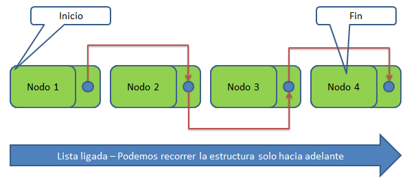

# Estructura de Datos: Lista Ligada Simple 🔗

## 🔬 Concepto Fundamental
La **Lista Ligada** (o lista enlazada simple) es la variante estructural dinámica más elemental que existe en la ciencia de la computación. 

En esta estructura de datos tenemos un conjunto de nodos que están enlazados **solo con el nodo siguiente**. De tal forma que, si queremos recorrer la colección, lo haremos estrictamente desde el primero (la cabeza) hasta el último, pero **no podremos regresar** (es unidireccional).

Como podemos apreciar en la ilustración, una lista es un conjunto de nodos donde cada entidad individual agrupa dos componentes inseparables:
1. Un **Objeto de valor** (el dato o la información útil para nosotros).
2. Una **Referencia** (puntero o enlace de memoria) hacia el siguiente nodo de la secuencia.

---

## ⏱️ Análisis Espaciotemporal (Big O)
El diseño unidireccional de esta estructura define su eficiencia computacional. A diferencia de un arreglo estático, no tiene índices:

| Operación | Complejidad | Descripción Técnica |
| :--- | :---: | :--- |
| **Acceso / Búsqueda** | $O(n)$ | Requiere un recorrido secuencial forzoso nodo por nodo. |
| **Inserción al Inicio** | $O(1)$ | Extremadamente rápido. Solo se reasignan los punteros de la cabeza. |
| **Inserción al Final** | $O(n)$ | Requiere recorrer toda la lista para enlazar al último nodo. |
| **Eliminación** | $O(n)$ | Requiere ubicar el nodo previo para reconectar y no perder la cadena. |

---

## ⚖️ Ventajas y Limitaciones

### ✅ ¿Por qué usarla?
* **Gestión de Memoria:** La estructura crece o se encoge exactamente según la cantidad de datos en tiempo de ejecución. No hay desperdicio por "espacios vacíos".
* **Inserciones limpias:** No requiere desplazar bloques masivos de memoria como lo haría un arreglo estático al insertar un dato al principio.

### ❌ Desventajas
* **No hay acceso aleatorio:** No puedes pedir directamente el "elemento 5"; debes caminar obligatoriamente desde el 0 hasta el 5.
* **Sobrecarga de Memoria (Overhead):** Por cada dato guardado, se gasta memoria adicional obligatoria para almacenar la referencia al siguiente nodo.

* 
**Desarrollado por:** Aramayo Calle Karol Josef
  
**Materia:** Estructura de Datos 1  

**Semestre:** 1/2026
